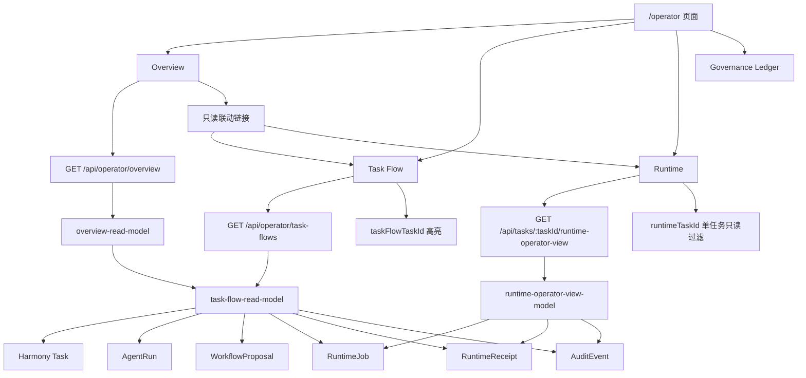

# Operator Console Sprint A-D 阶段性建设总结

## 文档目的

本文档沉淀 `Operator Console` 在最小任务包 A / B / C / D 中已经完成的建设结果，明确：

- 当前只读治理控制台已经具备哪些能力
- 这些能力分别落在哪些文件和接口中
- 当前的只读安全边界是什么
- 下一阶段建议优先推进什么

本文档只描述当前已落地实现，不引入新的执行入口，也不扩展未实现能力。

---

## 当前 Operator Console 架构图



---

## 任务包 A

### 建设目标

- 建立统一的任务生命周期阶段模型
- 给 `runtime-operator-view` 增加只读 `lifecycle`
- 将 `/operator` 重构为四个一级视图：
  - `Overview`
  - `Task Flow`
  - `Runtime`
  - `Governance Ledger`

### 涉及文件

- `src/lib/workflow/lifecycle.ts`
- `src/lib/workflow/index.ts`
- `src/lib/runtime-execution/operator-view-model.ts`
- `src/lib/runtime-execution/read-models.ts`
- `src/lib/runtime-execution/task-summary.ts`
- `src/components/operator-console/runtime-execution-panel.tsx`
- `src/app/operator/page.tsx`

### 核心数据结构 / API

1. 生命周期阶段模型

```ts
type TaskLifecyclePhase =
  | 'intake'
  | 'consensus'
  | 'planning'
  | 'execution'
  | 'review'
  | 'repair'
```

2. 生命周期派生函数

```ts
deriveTaskLifecyclePhase(input)
```

它根据以下只读信号派生阶段：

- `taskStatus`
- `hasWorkflowProposal`
- `hasRuntimeJob`
- `latestRuntimeStatus`
- `hasEvalOrReview`
- `hasBlockedOrFailedExecution`

3. Runtime 视图模型新增

- `runtime-operator-view` 增加 `lifecycle`
- 仅用于展示，不驱动执行

### UI 改动

- `/operator` 从原始面板集合整理为四个一级视图
- Runtime 区域展示：
  - 生命周期阶段
  - runtime summary
  - 最新 receipt
  - live / succeeded / blocked / failed 状态带

### 安全边界

- `lifecycle` 只是 derived state
- 不新增 shell / git / deploy / MCP / 文件写入执行入口
- 不新增 `claim / run / complete / retry / approve` 等 UI 操作
- Runtime 面板保持只读

### 已验证测试

- `src/lib/workflow/__tests__/lifecycle.test.ts`
- `src/lib/runtime-execution/__tests__/operator-view-model.test.ts`
- `src/lib/runtime-execution/__tests__/task-summary.test.ts`
- `src/components/operator-console/__tests__/operator-console.test.ts`

### 遗留问题

- 当时未处理结构化任务流视图，`Multi-Agent Flow` 仍是旧路径
- Overview 仍依赖多 API 拼装，未统一到结构化 read model

---

## 任务包 B

### 建设目标

- 建立结构化 `task flow` read model
- 新增只读 API：`GET /api/operator/task-flows?limit=5`
- 将 `Multi-Agent Flow` 从 assistant 文本解析改为结构化数据源

### 涉及文件

- `src/lib/operator-console/task-flow-read-model.ts`
- `src/app/api/operator/task-flows/route.ts`
- `src/components/operator-console/multi-agent-flow.tsx`
- `src/lib/operator-console/__tests__/task-flow-read-model.test.ts`
- `src/app/api/operator/task-flows/__tests__/route.test.ts`
- `src/components/operator-console/__tests__/operator-console.test.ts`

### 核心数据结构 / API

1. 结构化节点类型

```ts
type OperatorTaskFlowNodeType =
  | 'task'
  | 'agent_run'
  | 'workflow'
  | 'runtime_job'
  | 'runtime_receipt'
  | 'audit'
```

2. 结构化 flow 模型

```ts
interface OperatorTaskFlowReadModel {
  taskId: string
  title: string
  status: string
  lifecycle: DerivedTaskLifecycle
  nodes: OperatorTaskFlowNode[]
}
```

3. 只读 API

```http
GET /api/operator/task-flows?limit=5
```

返回：

```json
{
  "ok": true,
  "data": [...]
}
```

4. 聚合主链路

- `Harmony Task`
- `AgentRun`
- `RuntimeJob`
- `RuntimeReceipt`

同时补充可安全关联的：

- `WorkflowProposal`
- `AuditEvent`

### UI 改动

- `Multi-Agent Flow` 改为读取 `/api/operator/task-flows?limit=5`
- 每个 flow 按结构化节点展示
- 去掉 assistant 消息文本解析逻辑
- 仅展示，不提供操作

### 安全边界

- 不改底层状态机
- 不新增数据库字段
- 不新增真实执行入口
- `task flow` 为纯只读聚合

### 已验证测试

- `src/lib/operator-console/__tests__/task-flow-read-model.test.ts`
- `src/app/api/operator/task-flows/__tests__/route.test.ts`
- `src/components/operator-console/__tests__/operator-console.test.ts`

### 遗留问题

- `task flow` 与 Overview 之间尚未统一联动
- 每个 flow 尚未提供显式的页面定位锚点

---

## 任务包 C

### 建设目标

- 建立 `Operator Overview` 结构化只读 read model
- 新增只读 API：`GET /api/operator/overview?limit=5`
- 将 Overview 从多 API 拼装改为结构化总览数据源
- 新增三块摘要：
  - `Active Runtime`
  - `Blocked Summary`
  - `Recent Receipts`

### 涉及文件

- `src/lib/operator-console/overview-read-model.ts`
- `src/app/api/operator/overview/route.ts`
- `src/components/operator-console/operator-overview.tsx`
- `src/lib/operator-console/__tests__/overview-read-model.test.ts`
- `src/app/api/operator/overview/__tests__/route.test.ts`
- `src/components/operator-console/__tests__/operator-console.test.ts`

### 核心数据结构 / API

1. Overview read model

```ts
interface OperatorOverviewReadModel {
  generatedAt: string
  totals: {...}
  activeRuntime: { count: number; items: ...[] }
  blockedSummary: { count: number; items: ...[] }
  recentReceipts: { count: number; items: ...[] }
  recentFlows: OperatorTaskFlowReadModel[]
  safetyNote: string
}
```

2. 聚合方式

Overview 复用任务包 B 的：

```ts
listOperatorTaskFlows()
```

派生：

- `activeRuntime`：`runtime_job` 且状态为 `queued | leased | running`
- `blockedSummary`：来自 `blocked / failed task`、`agent_run`、`runtime_job`、`repair lifecycle` 或 `audit`
- `recentReceipts`：`runtime_receipt` 按时间倒序

3. 只读 API

```http
GET /api/operator/overview?limit=5
```

### UI 改动

- `OperatorOverview` 不再直接请求：
  - `/api/conversations`
  - `/api/harmony/tasks`
  - `/api/audit/agent-runs`
  - `/api/tool-calls`
  - `/api/eval-runs`
  - `/api/workflow-proposals`
- 改为单一结构化总览接口
- 新增三块总览摘要卡片
- 保留安全边界说明

### 安全边界

- Overview 仅渲染 derived state
- 不暴露 worker / connector / token issuance / mutation controls
- 不新增执行按钮

### 已验证测试

- `src/lib/operator-console/__tests__/overview-read-model.test.ts`
- `src/app/api/operator/overview/__tests__/route.test.ts`
- `src/components/operator-console/__tests__/operator-console.test.ts`

### 遗留问题

- Overview 与 Task Flow / Runtime 之间尚无页面级只读联动
- 只能看摘要，不能直接定位到对应 flow 或 runtime 区域

---

## 任务包 D

### 建设目标

- 增强 `Overview / Task Flow / Runtime` 三个一级视图之间的只读联动能力
- 支持：
  - Overview 摘要定位到 `Task Flow`
  - Overview 摘要定位到 `Runtime`
  - Task Flow 对被定位任务高亮
- Runtime 仍继续只通过 `runtimeTaskId` 展示单任务只读运行态

### 涉及文件

- `src/lib/operator-console/task-flow-read-model.ts`
- `src/lib/operator-console/overview-read-model.ts`
- `src/app/operator/page.tsx`
- `src/components/operator-console/operator-overview.tsx`
- `src/components/operator-console/multi-agent-flow.tsx`
- `src/lib/operator-console/__tests__/task-flow-read-model.test.ts`
- `src/lib/operator-console/__tests__/overview-read-model.test.ts`
- `src/components/operator-console/__tests__/operator-console.test.ts`

### 核心数据结构 / API

1. Task Flow 导航字段

```ts
navigation: {
  taskFlowHref: "/operator?taskFlowTaskId=<taskId>#task-flow"
  runtimeHref: "/operator?runtimeTaskId=<taskId>#runtime"
}
```

2. Overview 摘要项导航字段

- `activeRuntime[].navigation`
- `blockedSummary[].navigation`
- `recentReceipts[].navigation`

3. 页面只读参数

- `runtimeTaskId`
- `taskFlowTaskId`

其中：

- `runtimeTaskId`：Runtime 单任务只读过滤
- `taskFlowTaskId`：Task Flow 中对应 flow 高亮

### UI 改动

- Overview 三块摘要项增加只读链接：
  - `View Task Flow`
  - `View Runtime`
- Task Flow 每个 flow 增加只读定位信息：
  - `Task Flow Anchor`
  - `Runtime View`
- `taskFlowTaskId` 命中时，flow 显示 `Linked selection`
- Runtime 区域无新增按钮，仅继续通过 `runtimeTaskId` 切换目标任务

### 安全边界

- 新增的是页面跳转链接，不是执行动作
- 不新增 mutation API
- 不新增自动刷新、轮询、SSE
- 不新增 `claim / run / complete / retry / approve`

### 已验证测试

- `src/lib/operator-console/__tests__/task-flow-read-model.test.ts`
- `src/lib/operator-console/__tests__/overview-read-model.test.ts`
- `src/components/operator-console/__tests__/operator-console.test.ts`

### 遗留问题

- 当前只支持任务级跳转，不支持 node 级 deep link
- 只做 URL + hash 导航，不做自动滚动动画或复杂历史态管理

---

## 只读安全边界清单

### 已明确禁止

- 真实执行 Agent
- 自动路由 Task
- 分配 runtime Agent
- 运行 Tool / Workflow / Step
- 写文件 / 运行 Git 写操作
- 调用外部 API / 连接 MCP
- 创建 PR / 部署 / 发布 / Release
- 自动推进任务到 completed
- Retry / Replay / Rollback / Restore / Resume execution

### 当前允许

- 查看结构化读模型
- 查看 runtime 只读状态
- 查看 audit / evidence / workflow / receipt 摘要
- 审查本地记录状态
- 通过只读链接在 Overview / Task Flow / Runtime 间定位

### 当前实现上的硬边界

1. 所有新增 API 都是 `GET` 只读接口
2. 所有新增字段都是 derived state 或 navigation metadata
3. 页面参数只用于过滤和高亮，不触发执行
4. 组件中不新增执行按钮
5. 不扩展状态机
6. 不变更数据库 schema

---

## 当前阶段验证情况

### 已验证的相关测试

- `src/lib/workflow/__tests__/lifecycle.test.ts`
- `src/lib/runtime-execution/__tests__/operator-view-model.test.ts`
- `src/lib/runtime-execution/__tests__/task-summary.test.ts`
- `src/lib/operator-console/__tests__/task-flow-read-model.test.ts`
- `src/lib/operator-console/__tests__/overview-read-model.test.ts`
- `src/app/api/operator/task-flows/__tests__/route.test.ts`
- `src/app/api/operator/overview/__tests__/route.test.ts`
- `src/components/operator-console/__tests__/operator-console.test.ts`

### 构建与静态检查

- `npm run lint` 通过
  - 当前仅保留既有 warning：`src/lib/tools/engine.ts` 中 2 个 unused symbol
- `npm run build` 通过

### 当前未扩修的问题

全量 `npm run test` 仍存在既有问题，未纳入本阶段修复范围：

- `src/lib/mvp-closure/__tests__/mvp-eval.test.ts` 有既有失败
- 存在 git 权限问题：
  - 无法访问 `C:\Users\18168/.config/git/ignore`
  - 无法创建 `.git/index.lock`

---

## 后续 Sprint 建议 Backlog

### P0

1. Operator Console 文案与乱码面专项收敛  
当前部分旧面板仍残留历史乱码文案，建议统一收敛，避免新旧体验割裂。

2. Task Flow / Runtime 更细粒度的只读定位  
在保持只读前提下，支持从 flow 节点级别定位到 runtime 卡片或 receipt 区块。

3. Overview / Task Flow / Runtime 的共享导航协议文档化  
将 `runtimeTaskId`、`taskFlowTaskId`、hash 锚点规则补进 runbook，降低后续改动成本。

### P1

1. Runtime 视图增加更稳定的 latest receipt / latest blocked signal 摘要
2. Task Flow 增加节点分组视图  
例如按 `Task / Agent / Runtime / Receipt / Audit` 分栏展示。
3. Overview 增加“最近异常任务”与“最近 repair lifecycle”聚合卡片

### P2

1. 只读筛选能力  
例如按状态筛选 Task Flow 或 Overview 摘要。

2. 只读导出视图  
例如导出当前 Overview / Task Flow 的快照数据。

3. Operator Console 架构图进一步细化  
补充 Task / Agent / Runtime / Audit 之间的读模型关系图。

---

## 结论

最小任务包 A / B / C / D 已经把 `Operator Console` 从分散面板推进到一个具备如下特征的只读治理控制台：

- 有统一生命周期阶段模型
- 有结构化 Task Flow
- 有结构化 Overview
- 有 Runtime 单任务只读视图
- 有 Overview / Task Flow / Runtime 之间的只读联动
- 有清晰的 Sprint 22 安全边界

下一阶段最值得做的，不是继续扩执行，而是先把只读治理体验打磨完整：文案、定位、摘要质量、runbook 文档和边界说明。
